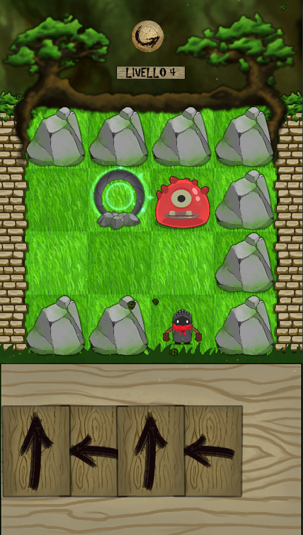
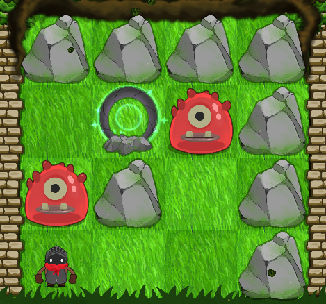

# Move 'em All

## The game
Move 'em All is a 2d cartoon mobile card puzzle game. It was developed in Pisa(IT) as a Internet Festival 2019 game jam entry.  

You control both the player and the enemies only using the available cards. Navigate through each world, avoiding enemies and reaching the portal for the next adventure. But watch out! You have only a limited amount of moves each level!

## Images
 

## Download
Download the latest release here for [Android](https://github.com/KlausRenzo/Move-Them-All/releases/latest)

## Credits

|Name|Role|
|---|---|
| Nicolò Renzoni | Game Programmer |
| Daniel Sidorenko | Game Design |
| Fabio Fatticcioni | Concept Art |
| Michela Montesi | Concept Art |